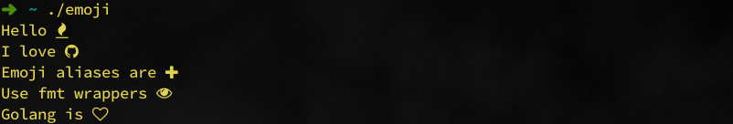

# gmoji 😎

<div>
  <a href="">
    
  </a>
  <a href="https://golang.org/">
    
  </a>
  <a href="https://github.com/sami2020pro/gmoji/blob/master/LICENSE">
    
  </a>
</div>

<!---->

`gmoji` is a emoji library for Go. It lets you use emoji characters in strings and you can use in **Terminal**.

# Install 🤠

```golang
go get -u github.com/sami2020pro/gmoji
```

# Usage ✊
```golang
package main

import (
        "fmt"

        "github.com/sami2020pro/gmoji"
)

func main() {
        fmt.Printf("Hello %v\n", gmoji.Fire)

        emoji := gmoji.GitHub
        fmt.Printf("I love %v\n", emoji)

        fmt.Println(gmoji.Parse("Emoji aliases are :Plus:"))
        gmoji.Println("Use fmt wrappers :Eye:")
        gmoji.Print("Golang is :HeartOutlined:\n")
}
```

Output

<div>
  <a href="data/gmoji-output.png">
    
  </a>
</div>

# Testing 🍷
```golang
go test
```
# Contributing 💻
You can send **Pull Request**

# References 📃
<ul>
  <li><a href="https://www.fontawesomecheatsheet.com/" style="text-decoration:none;">fontawesomecheatsheet</a></li>
</ul>

# Credits ⭐
<ul>
  <li><a href="https://www.github.com/sami2020pro" style="text-decoration:none;">Sami Ghasemi</a></li>
</ul>

# License 📜
The MIT License (MIT). Please see <a href="https://github.com/sami2020pro/suftime/blob/master/LICENSE">License File</a> for more information.
